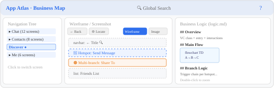

# App Atlas

> 一个用于创建移动应用「可视化业务地图」的工具框架。  
> 将 App 每一屏的 UI 结构、交互热区、跳转关系和业务逻辑以地图形式呈现。

**拿到即用**——零 npm 依赖、零构建步骤，配置好源码路径即可让 AI Agent 自动采集，或手动编写。

### ✨ 为什么需要 App Atlas？

| | 痛点 | App Atlas 的解法 |
|---|------|-----------------|
| 🧠 | AI 每次对话都要重新搜索代码、理解业务，Token 消耗巨大 | 一次采集，永久复用——AI 直接读取结构化业务地图，省去 80% 重复搜索 |
| 👻 | AI 时代代码产出增多，人对代码的"记忆点"反而变少 | 业务逻辑、数据流向、交互链路全部留痕可视化，随时可查 |
| 🔍 | 新人 / 跨团队协作需要反复问"这个页面的逻辑是什么" | 开发、测试、产品打开地图即可定位功能、代码、接口、数据来源 |
| 🔒 | SaaS 文档工具有数据泄露风险 | 纯本地部署，零网络依赖，源码和业务数据不出内网 |
| 🗺️ | 复杂 App 几百个页面，缺乏全局视角 | 模块 → 页面 → 热区 → 跳转，一张地图串联全链路 |
| 🤖 | AI Agent 缺乏可靠的 App 级上下文 | 结构化 manifest + logic.md 天然适配 Agent 读取，是最好的 App 知识库 |

---

## 使用说明

### 页面布局



界面分为三栏：
- **左侧导航树**：按模块分组展示所有页面，点击切换
- **中间展示区**：线框图模式（结构化 UI 块 + 可点击热区）或图片模式（真机截图 + 热区覆盖层）
- **右侧逻辑面板**：展示 logic.md 业务逻辑（支持 Mermaid 流程图、页面内搜索）

### 热区类型


- 🔵 **普通热区**（蓝色虚线）：点击查看跳转目标，直接导航到下一屏
- 🟠 **多分支热区**（橙色实线）：点击弹出分支选择，按不同条件跳转不同页面
- 📋 **其他入口**（侧边清单）：手势类 / 无固定位置的交互，列在截图右侧

### 操作指引


1. 顶部搜索栏输入关键词 → 匹配已收集的页面 → 点击跳转
2. 搜索无结果时 → 点「让 Claude 收集」→ AI 自动分析源码并生成页面数据 → 完成后自动跳转

---

## 快速开始

```bash
# 1. 克隆
git clone https://github.com/innepeace/app-atlas.git my-app-atlas
cd my-app-atlas

# 2. 配置源码项目路径
cp atlas.config.example.json atlas.config.json
# 编辑 atlas.config.json，填入你的 App 项目本地路径
# { "sourceProject": "/Users/xxx/your-ios-project" }

# 3. 启动服务
node tools/serve.mjs 37421

# 4. 浏览器打开
open http://127.0.0.1:37421/web/
```

首次启动若未配置源码路径，页面会自动弹出配置对话框引导填写。

---

## 工作方式

### 方式一：AI Agent 自动采集（推荐）

将本项目作为 AI Agent（Claude Code / Kiro / Cursor 等）的工作目录。Agent 会：

1. 读取 `atlas.config.json` 中指定的源码项目
2. 逐文件分析 VC / ViewModel / Cell / API 源码
3. 自动生成 `manifest.json`（页面结构）+ `logic.md`（业务逻辑）
4. 更新 `data/registry.json` 注册表

对话示例：
```
你: 收集 trade 模块的下单页
AI: (读源码 → 产出 manifest.json + logic.md → 校验通过)
```

Agent 的详细工作规范见 `AGENTS.md`、`rules.md`、`docs/CONVENTIONS.md`。

### 方式二：手动创建

```bash
mkdir -p data/modules/myModule/screens/myScreen
# 创建 manifest.json 和 logic.md（参考下方格式说明）
# 在 data/registry.json 中添加模块和屏幕条目
node tools/validate.mjs  # 校验
```

---

## 目录结构

```
app-atlas/
├── atlas.config.json         # 本地配置（不提交 git）
├── atlas.config.example.json # 配置模板
├── data/
│   ├── registry.json         # 全局注册表
│   ├── components.json       # 可复用组件目录
│   └── modules/
│       └── <module>/
│           └── screens/
│               └── <screenId>/
│                   ├── manifest.json   # 页面结构 + 热区 + 状态
│                   └── logic.md        # 业务逻辑文档
├── web/                      # 前端可视化（纯静态）
├── lib/                      # 核心库
├── tools/                    # CLI 工具
├── test/                     # 测试
├── AGENTS.md                 # AI Agent 工作手册
├── rules.md                  # 规则总纲
└── docs/
    ├── CONVENTIONS.md        # 收集守则（质量标准）
    └── SYNC.md               # 同步机制
```

---

## 常用命令

| 命令 | 说明 |
|------|------|
| `node tools/serve.mjs 37421` | 启动本地服务（Web 界面 + Claude 收集 API） |
| `node tools/validate.mjs` | 校验 registry + 所有 manifest 数据完整性 |
| `node --test` | 运行测试 |
| `node tools/sync.mjs` | 检测已收集屏的源码是否有变更 |
| `node tools/seed-skeleton.mjs` | 从路由文件批量生成模块骨架 |

---

## 核心数据格式

### manifest.json

描述一个页面的 UI 结构、交互热区、状态和跳转关系：

```jsonc
{
  "screen": {
    "id": "orderConfirm",           // 唯一 ID
    "module": "trade",              // 所属模块
    "title": "确认下单",             // 显示标题
    "route": "/trade/confirm",      // App 内路由
    "description": "..."
  },
  "source": {
    "vc": "OrderConfirmVC.swift",   // 主 ViewController
    "vm": "OrderConfirmVM.swift",   // ViewModel（可选）
    "files": ["..."],               // 涉及的源文件
    "rev": "a1b2c3d"                // 源码 git 短 SHA
  },
  "layout": [
    // UI 结构树（支持嵌套 children）
    { "type": "navbar", "id": "nav", "label": "← 确认下单" },
    { "type": "button", "id": "btn-submit", "label": "提交订单" }
  ],
  "states": [
    { "id": "default", "label": "默认态", "note": "正常显示" },
    { "id": "loading", "label": "提交中", "note": "按钮 loading" }
  ],
  "hotspots": [
    {
      "id": "btn-submit",
      "label": "提交订单",
      "kind": "action",              // navigate / action / service
      "logic_ref": "#submit-order",  // 对应 logic.md 的 ### submit-order
      "branches": [
        { "condition": "校验通过", "label": "提交成功", "goto": "orderResult" },
        { "condition": "校验失败", "label": "弹出错误提示", "goto": "" }
      ]
    }
  ],
  "links": { "prev": ["orderEntry"], "next": ["orderResult"] },
  "status": "collected"
}
```

### logic.md

```markdown
# orderConfirm — 确认下单

## 概述
`OrderConfirmVC` 继承 `BaseVC`（push）。核心交互：展示订单详情 → 确认 → 提交。

## 主流程
​```mermaid
flowchart TD
    A[从 orderEntry 跳入] --> B[加载订单数据]
    B --> C{用户点击提交}
    C -->|校验通过| D[调用下单接口]
    C -->|校验失败| E[弹出错误]
    D --> F[跳转 orderResult]
​```

## 分支逻辑
### submit-order
触发链：`submitBtn.rx.tap` → `viewModel.submitOrder()` → 校验 → API

## 业务规则
- 金额不能超过可用余额
- 交易密码验证（首次下单）

## 相关代码
| 文件 | 职责 |
|------|------|
| OrderConfirmVC.swift | 主 VC |

## 待补充
- 限价/市价切换逻辑待核对
```

### registry.json

```jsonc
{
  "schemaVersion": 1,
  "roots": [],
  "modules": [
    {
      "id": "trade",
      "name": "交易",
      "screens": [
        { "id": "orderConfirm", "title": "确认下单", "route": "/trade/confirm", "status": "collected" },
        { "id": "orderResult", "title": "下单结果", "route": "/trade/result", "status": "uncollected" }
      ]
    }
  ]
}
```

---

## 适用场景

- **任意移动应用**：iOS / Android / Flutter / React Native
- **团队知识沉淀**：新人快速了解 App 全貌和业务逻辑
- **业务评审**：可视化交互链条，发现遗漏
- **测试参考**：交互覆盖度、分支路径一目了然
- **AI 知识库**：辅助 Agent 理解代码时的结构化上下文

---

## 配置说明

`atlas.config.json`（本地文件，不提交 git）：

```json
{
  "sourceProject": "/Users/xxx/your-project-root"
}
```

`sourceProject`：目标 App 源码的本地绝对路径，AI Agent 会从中读取源码进行分析和采集。

---

## 当前状态与贡献

App Atlas 源于日常移动端开发中的实际需求——在 AI 辅助开发的过程中，我们发现缺少一个结构化的、可持续积累的 App 业务知识库。于是有了这个项目。

**目前的局限**：

- 主要针对**原生 iOS / Android App** 的页面级业务收集，对 Web、小程序、后端服务等场景尚未适配
- 采集依赖 AI Agent 对源码的理解能力，复杂架构（如大量动态路由、Runtime 注入）可能需要人工辅助
- 可视化侧重「页面 → 热区 → 跳转」链路，对非页面级流程（如后台任务、推送链路）的表达还不够完善

**欢迎参与**：

这个项目仍处于早期阶段，有很多可以改进的方向。如果你有兴趣将它扩展到其他平台、其他场景，或者有任何改进想法，欢迎：

- 🍴 **Fork** — 基于你的场景做定制
- 🐛 **Issue** — 反馈问题或提出建议
- 🔀 **Pull Request** — 直接贡献代码

---

## License

MIT
