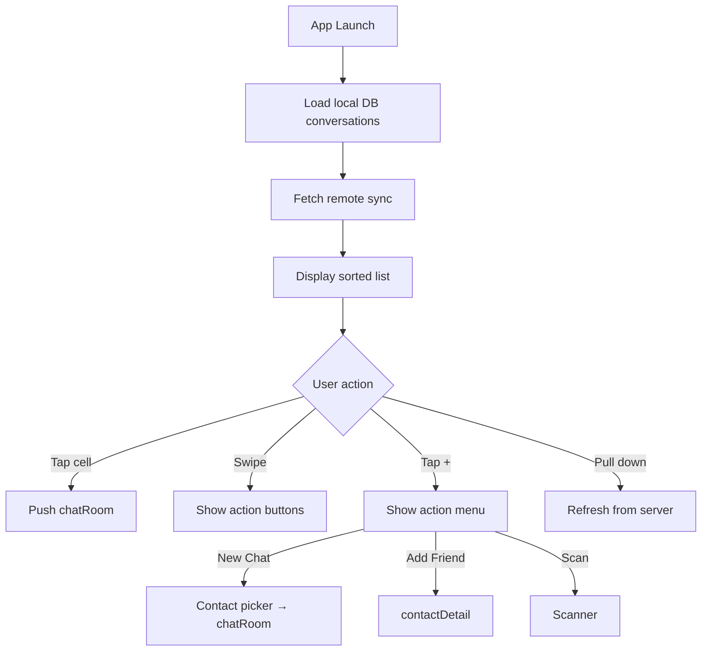

# chatList — Chat List

## Overview

`ChatListViewController` inherits `BaseTabViewController` (tab root). Displays recent conversations with unread badges, pinned chats on top, and swipe actions.

Entry: App launch → Tab 0 (Chat).

Core interactions: Pull to refresh, tap to enter chat room, swipe to pin/mute/delete, search filter, "+" menu for new chat/add friend/scan.

## Main Flow

## Data Sources

| Data | Source | Parameters | Fields |
|------|--------|-----------|--------|
| Conversations | Local DB + `/api/sync/conversations` | lastSyncTime | `[{id, name, avatar, lastMsg, time, unread, pinned, muted}]` |
| Unread count | WebSocket push | — | `{conversationId, count}` |

## Branch Logic

### search

Trigger: `searchBar.rx.text` → `viewModel.filterConversations(keyword:)` → reload table with filtered results.

- Empty keyword → show full list
- Matches name or last message content

### add-menu

Trigger: `addBtn.rx.tap` → show `UIAlertController` action sheet with 3 options.

- New Chat → push `ContactPickerVC`, on select → create/open conversation → push `chatRoom`
- Add Friend → push `AddFriendVC`
- Scan QR → push `ScannerVC`

### tap-chat

Trigger: `tableView(_:didSelectRowAt:)` → `Router.open("/chat/room", params: ["conversationId": id])`

### swipe-actions

Trigger: `tableView(_:trailingSwipeActionsConfigurationForRowAt:)`

- **Pin**: `viewModel.togglePin(conversationId:)` → reorder list, pinned items at top
- **Mute**: `viewModel.toggleMute(conversationId:)` → hide badge for this conversation
- **Delete**: confirm alert → `viewModel.deleteConversation(id:)` → remove from list and local DB

## Business Rules

- Pinned conversations always appear at top, sorted by time within pinned group
- Unread badge max display: 99+
- Muted conversations show a small "muted" icon instead of unread count
- WebSocket reconnects automatically on network recovery
- Local DB is source of truth; remote sync merges incrementally

## Related Code

| File | Responsibility |
|------|----------------|
| ChatListViewController.swift | Main VC, table view delegate |
| ChatListViewModel.swift | Data fetching, filtering, CRUD |
| ConversationCell.swift | Cell UI: avatar, name, message preview, badge |
| ChatDBManager.swift | Local database operations |

## To Be Completed

- Group chat creation flow
- Conversation archive feature
