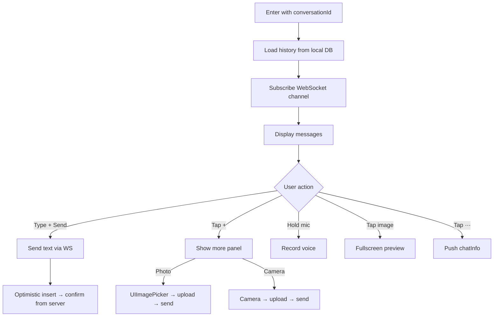

# chatRoom — Chat Room

## Overview

`ChatRoomViewController` inherits `BaseVC` (push). Real-time messaging via WebSocket with support for text, image, voice, video, location, and file messages.

Entry: `chatList` tap conversation → `Router.open("/chat/room", params: ["conversationId": id])`.

## Main Flow

## Branch Logic

### back
Trigger: `navBackBtn.rx.tap` or swipe back gesture → `navigationController?.pop`

### chat-info
Trigger: `infoBtn.rx.tap` → `Router.open("/chat/info", params: ["conversationId": id])`

### send-message
Trigger: `sendBtn.rx.tap` → `viewModel.sendText(input.text)`
- Validates non-empty text
- Creates local message with `status: .sending`
- Sends via WebSocket
- On ACK: update status to `.sent`
- On timeout (10s): update status to `.failed`, show retry button

### more-panel
Trigger: `moreBtn.rx.tap` → toggle `MorePanelView` visibility
- Photo: `PHPickerViewController` → compress → upload to CDN → send image message
- Camera: `UIImagePickerController(.camera)` → same flow
- Location: `LocationPickerVC` → send location message with lat/lng/address
- File: `UIDocumentPickerViewController` → upload → send file message

### image-preview
Trigger: `imageBubble.tapGesture` → present `ImageBrowserVC` with all images in conversation, positioned at tapped index.

## Business Rules

- Messages stored in local DB immediately (offline-first)
- Max image size: 10MB, auto-compressed to 1024px width
- Voice message max duration: 60s
- Message retry: tap failed message to resend
- Read receipts sent when scrolling to bottom
- Typing indicator shown when remote user is typing (WebSocket event)

## Related Code

| File | Responsibility |
|------|----------------|
| ChatRoomViewController.swift | Main VC, collection view |
| ChatRoomViewModel.swift | Message CRUD, WebSocket handling |
| MessageCell.swift | Base bubble cell |
| ImageMessageCell.swift | Image rendering + tap |
| VoiceMessageCell.swift | Voice playback UI |
| WebSocketManager.swift | Connection lifecycle |
