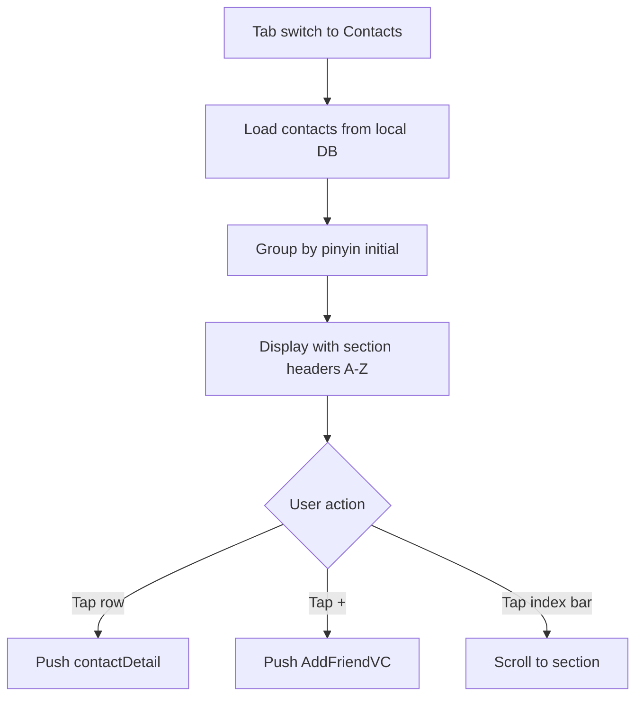

# contactList — Contacts

## Overview
`ContactListViewController` (tab root). Shows all friends alphabetically with section index sidebar.

## Main Flow

## Branch Logic
### add-friend
Trigger: `addBtn.rx.tap` → push `AddFriendViewController` (search by phone/ID).

### tap-contact
Trigger: `tableView(_:didSelectRowAt:)` → `Router.open("/contacts/detail", params: ["userId": id])`

## Business Rules
- Contacts sorted by pinyin; special characters grouped under "#"
- Friend request badge shown on "New Friends" entry at top
- Contact list cached locally, synced on app launch
