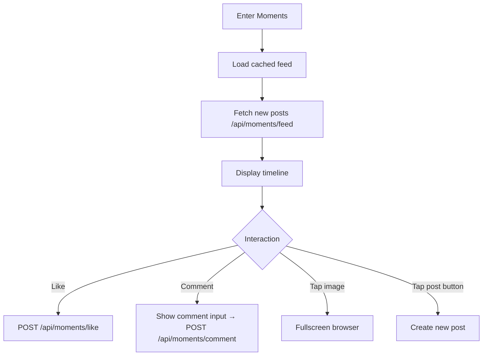

# moments — Moments

## Overview
`MomentsViewController` (push). Friends' social feed with photos, text, likes and comments.

## Main Flow

## Branch Logic
### back
Pop to discoverMain.

### new-post
- **Tap** camera icon: open `PHPickerViewController` → select up to 9 images → `PostComposeVC`
- **Long press** camera icon: text-only compose (no images)

### post-interact
- **Like**: `likeBtn.rx.tap` → `viewModel.toggleLike(postId:)` → optimistic UI update
- **Comment**: tap comment icon → keyboard up with input bar → submit → insert in list
- **Tap image**: `imageView.tapGesture` → `ImageBrowserVC` with page scroll

## Business Rules
- Feed paginated: 20 posts per page, load more on scroll
- Images: max 9 per post, displayed in 3-column grid
- Like list shows up to 10 names inline
- Posts older than 3 days: hide from feed unless from close friends
- Cover photo at top is customizable (tap to change)
